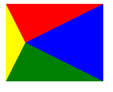
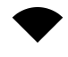
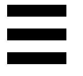
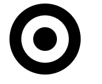

# css应用

## 绘制三角形

```css
.box {
  border-top: 40px solid red;
  border-right: 80px solid blue;
  border-bottom: 40px solid green;
  border-left: 20px solid yellow;
  width: 0;
  height: 0;
}
```

绘制出的三角形如下: 


需要注意的关键点

- 矩形中, 单个border的宽度对应三角形顶点与矩形边的垂线长
- 三角形对应的矩形边的长度 = 相邻两侧的三角形的border宽度

## 绘制扇形
```css
.box {
  border-top: 20px solid black;
  border-right: 20px solid transparent;
  border-bottom: 20px solid transparent;
  border-left: 20px solid transparent;
  border-radius: 20px;
  width: 0px;
  height: 0px;

  background-clip: content-box;
}
```


## 绘制三明治

```css
.box {
  border-top: 10px solid black;
  border-bottom: 10px solid black;
  padding-top: 10px;
  padding-bottom: 10px;
  width: 50px;
  height: 10px;

  background-color: black;
  background-clip: content-box;
}
```



## 绘制圆环

```css
.box {
  border: 10px solid black;
  border-radius: 50%;
  padding: 10px;
  width: 20px;
  height: 20px;

  background-color: black;
  background-clip: content-box;
}
```


## 1px线问题

这个问题主要发生在苹果`Retina`屏当中, 该屏幕一般会用两个物理像素去绘制一个逻辑像素, 所以1px的线在屏幕上显示为2px, 比实际要粗.

解决方法: ::after伪元素 + 盒模型尺寸放大两倍 + transform缩小两倍

```css
.container[data-device="2"] {
    position: relative;
}

.container[data-device="2"]::after {
    position: absolute;
    top: 0;
    left: 0;
   
    box-sizing: border-box;
    border: 1px solid red;
    width: 200%;
    height: 200%

    transform-origin: left top;
    transform: scale(0.5);

    content: "";
}
```