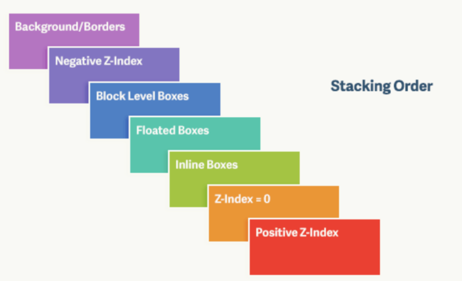

# css浮动与定位

## 为什么要清除浮动? 清除浮动的方式有哪些?

浮动元素

- 1.浮动元素会吸附到同级浮动方向的浮动元素边缘, 或者所在容器元素的外边缘
- 2. 浮动元素脱离了普通文档流, 且不参与容器元素的高度计算, 在容器元素当中占据的高度为0
- 3. 虽然浮动元素不占据容器的高度, 但是它会将容器当中的后代行内元素的内容"挤开"

为什么要清除浮动? 
A: 
1. 因为在容器元素高度未设置或者高度小于浮动元素的时候, 由于浮动元素在容器元素中占据的高度为0, 所以浮动元素的内容会溢出到容器元素外部
2. 浮动元素后面的文档流元素会上移, 可能会被浮动元素遮盖

清除浮动的方式

1. 在最后一个浮动元素对应的html标签添加一个空的div标签, 设置行内样式 `

`
2. 给容器元素建立块级格式化上下文(BFC), 比如容器元素设置`overflow: hidden`
3. 伪元素法. 在最后一个浮动元素后的第一个文档流元素当中, 通过::before在该文档流元素内部创建一个伪元素, 然后给伪元素设置样式 `display: block; content: "", clear: both`

## 对于BFC的理解. 如何创建BFC? BFC具有哪些特性

BFC(Block Formating Context, 块级格式化上下文): 块级格式化上下文相当于一个独立的布局空间, 定义了其中元素的布局规则, 且内部子元素的布局不会影响到块级格式化上下文外部的元素布局

创建BFC的方式(5种):

1. html默认是具有BFC的元素
2. display: inline-block, inline-table, table-caption, flex, inline-flex
3. float: left, right(除none以外)
4. overflow: auto, scroll, hidden(除visible以外)
5. position: absolute, fixed, sticky(除relative, static以外)

BFC的特性:

1. 外部特性: 自身不会与属于同一容器的浮动元素发生重叠
2. 内部特性
   1. 内部的浮动元素的高度会参与BFC元素高度计算, 即具有BFC的元素会包含住内部的浮动元素
   2. 内部子元素的纵向外边距不会与BFC元素外部的相邻元素的外边距发生重叠

## 什么是外边距折叠?

外边距折叠指的是相邻块级元素的纵向上下外边距会发生合并, 合并后取最大值作为两者之间的实际外边距.

外边距合并计算规则: 正正取大, 正负取和, 负负取最负

**外边距折叠发生的情况**

父元素与子元素外边距发生折叠

1. 普通文档流的块级父元素(padding-top, border-top为0)会与其第一个普通文档流的块级子元素的发生上外边距(margin-top)折叠
2. 普通文档流的块级父元素(padding-bottom, border-bottom, min-height为0, height为auto)会与其最后一个普通文档流的块级子元素的发生下外边距(margin-top)折叠

相邻兄弟元素外边距发生折叠: 相邻的块级元素元素的margin-top和margin-bottom会发生外边距折叠

空块级元素(无子元素, padding, border为0, min-height和height为0)自身的外边距会发生折叠

**不会发生外边距折叠的情况**

1. inline-block元素及其子元素不会与该元素相邻的元素发生外边距折叠
2. 绝对定位和浮动元素不会发生外边距折叠
3. 具有BFC的元素, 其与子元素的margin-top或者margin-bottom不会发生外边距折叠
4. 设置了border或padding的元素不会与其子元素的外边距发生折叠

**外边距折叠解决方案**

兄弟外边距折叠: 后一个元素设置下面三种样式中的一种

1. float: left | right
2. position: absolute
3. display: inline-block

父子外边距折叠

1. 父元素设置overflow: hidden; 或者设置透明border `border: transparent 1px solid`
2. 子元素设置 inline-block; 或者float; 或者position: absolute

## 层叠上下文

**什么时候会创建层叠上下文?**

1. 将position不为static的元素的z-index属性设置为明确数值
2. css3中的一些属性会使元素创建层叠上下文
    1. 父元素为display: flex, 子元素的z-index不是auto时, 子元素会形成一个层叠上下文
    2. opcity小于1
    3. filter不为none
    4. transform不为none

**什么是层叠上下文**

1. 层叠上下文设置了其对应的元素内部的子元素的图层层级顺序, 在页面显示的时候, 按照层叠顺序进行渲染和覆盖合并
2. 每当层叠上下文当中的子元素形成一个新的层叠上下文时, 该子元素的层叠上下文会作为父级层叠上下文的子级. 层叠上下文以树结构(图层树)进行管理
3. 元素的图层顺序或者说z-index, 以其所在的层叠上下文为基准

单个层叠上下文中, 子元素的层叠顺序: static < z-index: negative < 块级元素 < 浮动元素 < 行内元素 < z-index: auto (forward, position: absolute) < z-index: 0(position: absolute)  < z-index: auto (backward, position: relative) < z-index: positive (position: absolute)
示意图

## position属性值有哪些? 区别是什么?

| position  | 定位 |
|-------------- | -------------- |
| static    | 普通文档流当中的元素     |
| relative    | 以未relative定位前的位置作为参考进行定位, 通过top, right, bottom, left进行定位     |
| absolute    | 以首个postion属性值不为static的最近的祖先元素作为参考进行定位, 通过top, right, bottom, left进行定位     |
| fixed    | 以客户端视口作为参考进行定位, 元素位置不会随着页面滚动发生改变     |
| sticky    | 相当于relative和fixed的组合. 
              当视口顶部在sticky元素上方时, 表现为relative, 相对父元素元素进行定位.
              当视口超过sticky元素设置的top边界时, 表现为fixed, 相对视口进行定位; |
| inherit | 规定从父元素继承position属性的值

## display, float, position之间的关系

display为none: float和position设置成什么样都无所谓, 元素不在普通文档流当中

display不为none: 判断position是否是absolute或者fixed

- position是absolute或者是fixed, 那么float失效
- position不是absolute或者说fixed, 那么判断float是否为none