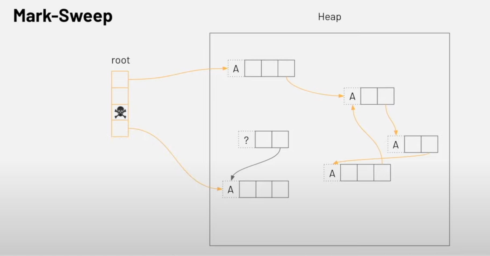

基本的垃圾回收

- 引用计数法
    - 如果有变量或者对象的属性引用了一个对象的话, 那么就会将对象的引用计数+1
    - 当变量或者对象的属性不再引用这个对象, 那么对象的引用计数-1
    - 当对象的引用计数变为0的时候, 会将对象看做为垃圾, 在垃圾回收时, 该对象会被清理掉
- 标记法: 以对象的可达性作为判断一个对象是否是垃圾对象
    

from space 和 to space

如何判断垃圾?

**引用计数**

**标记清理**

